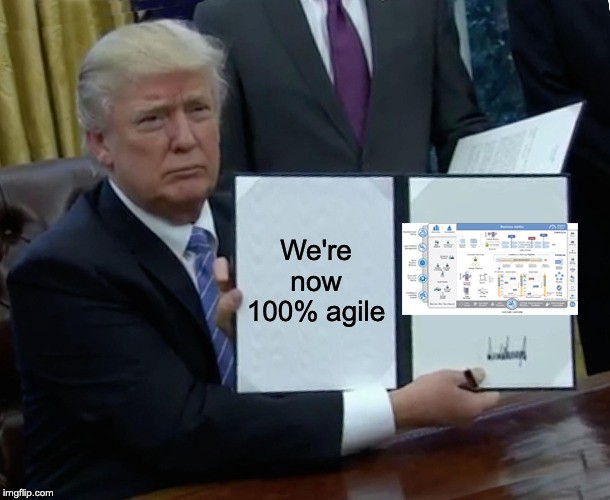
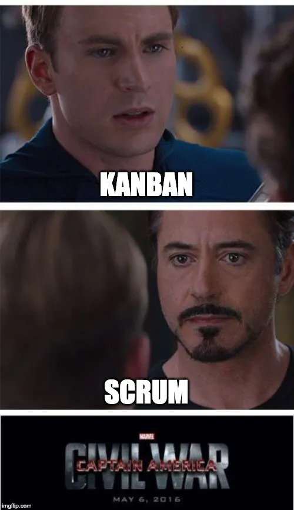

> How the rebellion got subverted



## The agile manifesto - The Rebellion that was not

The first time I heard the word agile manifesto was back in 2009. I had just graduated with a degree in Electronic and Telecommunication the previous year. As a wet behind the years novice in the industry I had decided that the best possible career move for me would be to act as a sponge and learn as much as possible from every one I had met online and offline both. This was when Git and Hg was just starting to make inroads in to general developers mind space. It was an exciting time - Android has just been released and our minds were buzzing with the possibilities of smartphones.

Those days, the startup I had been working on was a scrappy outfit trying to stay afloat doing whatever was possible and not take any VC money. Our founder had some
runway left but we had to be nimble on our feet and attack every opportunity with zeal if we were going to make it. And one of the things I had been concerned with was how to respond to the changes in priority that arise due to the fast changing nature of the projects and the goals of the company. We had been working steadily towards a product of our own so we could actually have a reliable product to bank on. But it was still in MVP stage and we had whole host of other projects going on so we could pay the bills.

Now the interesting thing was these were mostly very short term engagements. There were not multi year projects with team upon teams of developers involved in it. There were no business analysts writing user stories. No QA teams doing user acceptance testing and so on. It was just a few developers mostly working with one or two QA folks who kept these projects afloat. But we didn't have a single methodology for how these projects should be run resulting in a lot of confusion for all the parties involved.

I had heard about the agile movement and I vaguely remember seeing an article by Martin Fowler on the topic. This immediately piqued my interest since it seemed to be light on rules and bureaucracy and seemed to get to the point very quickly. This was not scrum or Scaled Agile Framework or any of the "enterprise" versions of agile. It was just a simple way of doing things that brought a little bit of order to the madness and let the team be predictable and present a more sane interface to management. This was very radical in that era since we had just started to implement [PRINCE2](https://prince2.wiki/) which was as heavy as they came.

## The call is coming from inside the house

I encounter agile again somewhere around 2013 when I switch teams within my Org to a mobile application focused team. In addition to using the latest and greatest in technologies in development, this team also was leading the pack in development processes. It was trying to be a thought leader in all these practices that were in with the crowd in those days. The implementation there was quite a stock one. Each team had a scope clearly defined they were responsible for. And the team sizes were just within the limits of what is possible for a normal scrum framework without resorting to SAFe and what not.

The only problem was that there was no real enforcement of continuous improvement. Daily standups of some teams would drag on for 45 minutes and most grooming and planning sessions (which were combined) would consist of - "well you obviously know how to get this done right? Just get the changes to services X, Y and Z done by friday". The defining feature of this team was how much deep domain and technical knowledge was still intact. Most of the people there had been there for several years and had written 95% of the stuff that was in production at the time. And the 5% that wasn't written by then had been modified by them to suit the rest of the system. So there was no real planning or grooming needed. Everyone knew who would work on a given piece of work and that person could tell you exactly how long that change would take. So it worked very very well until it didn't - When us noobs got there. Suddenly there was an influx of people who didn't know the system as well as incumbents and we started having all sorts of issues.

When I left that team and headed to my next team, I encountered the best version of agile that I have seen to date. The key was that, the new team was never afraid to change all the rules so that they could make things more efficient. Planning pokers were tried for a few months and found to be ineffective so we got rid of them. Retro's were too long so we shortened them. The standups were too virtual when done over video every day so we had one always-physical day of standup. And when everything was said and done, we had a very well tuned process and we loved it.

## Return to roots

I had returned from UK back to Sri Lanka and started working for a company based here, when I ran in to the full fledged Scaled Agile Frameowrk for Enterprises. Quite a mouthful right? And in short that will be SAFE. This is an enterprisy version of Agile practices. Now people like to make a distinction between the small "a" agile and big "A" Agile. This is most definitely of the latter kind. The team formation calls for various very distinctive and numerous roles and as with any enterprisy product, it comes with a lot of unwanted features, baggage and caveats.

The biggest issue that I had with it, is the amount of pompous ceremonies around it. There will be no way for the designated scrum master to allocate more than 50% of the time to actual business process work by working normally. So inevitably they will turn to working extra hours to catch up. The even worse part was that it was usually the most senior person in the team who will be the scrum master. So not only is the team loosing a really good engineering resource, now he will end up with a burnout after six months.

SAFE also tries to enforce communication lines, streamline them. What it actually end up doing is forcing tribal thinking and create self sabotaging teams. In the end you realize that it is just the traditional way of thinking ( Project -> Program -> Portfolio ) re-skinned with a slight agile twist. There is no real effort being made to follow the original agile manifesto in any way, shape or form. So you essentially end up building software the same exact way you did before just with less time and more admin overhead.

## Why is it so easy to fail?

And my story of agile implementations is no unique in any way. All over the software development firms, the ground truth is that almost all agile implementations have become liabilities that have slowed down deliveries, hampered team plans and frustrated good developers who are being held back by red tape they view and wholly useless. So why don't companies just "do the right thing®" and let the teams be fully agile? Why is it all too easy to fail.

I posit that the reason is the same reason most change management processes fail is the same reason that implementations of agile fail - humans resist change. More the change seems alien to us, the more we resist them. And agile practices, true agile practices are as alien as it gets compared to traditional waterfall practices. And I understand the temptation to seek assurance of waterfall method. waterfall eases the minds of management and it allows business analysts and PMs involved to take as much uncertainty out of the equation as possible. So what ends up happening is that on the very projects that it is supposed to help, the uncertain and hard to plan projects.

## How to undo this?

I think the key is to build rapport and support before it ever comes to decision time. There is a reason Ali was winning fights before ever setting foot in the ring. The reason that most agile implementations are not trusted is that they seem to add little value while adding a whole lot of work to the development teams and in general to everyone involved. The key to reversing this is to make sure that

1. Everyone involved understands why are doing the things that we are doing. Why does agile matter, what is it going to get us? And how will we know when agile is implemented right?

2. The fluff built around the agile methodologies are scrapped off during implementation. Strip every single methodology down to the bare bones. And then add in the bits you need as you go along

3. Understand what you are trying to measure. And do not, in the name of everything you love - ever measure that thing.

## Understanding the what, why and how

We should try to get all stakeholders to understand why want a particular agile methodology implemented - maybe it is scrum or maybe it is Kanban. Whatever it is, everyone involved should know why they are doing it and not something else. The new guys who joined yesterday should be able to tell you why you are doing Kanban and not scrum or waterfall. And you should not require a fifty page brief in order to understand it.

Always make sure you lead with this one. Be sure to compare and contrast with business as usual situation and other competing methodologies. That way everyone will have enough context to know why you are implementing things the way you are.And in the end give them a sense of where you want to end up. And explain that you are not quite there yet. Explain that this is a journey and not a one day task. Your teams wont be fully agile overnight. There will still be hiccups along the way and you will adjust a lot of things, but let them know why it is important and how they can know when they are there. Things will be running smoothly, there will be less admin overhead, the team will settle in to a nice delivery rhythm. Give them enough of an understanding on how to tell when they are doing it right

## Cutting out the fluff

No methodology is perfect. Fredrick brooks was right all those years ago. There is no silver bullet.You have to implement things yourself, evaluate and tweak things yourself.Whatever the methodology you chose - make sure to start from only the most essential parts of the methodology. Anything that is strictly mandatory, cut out.And then run a couple of weeks on that platform and see how you like it, talk to the team, review with stakeholders and add or change things accordingly. Remember that communication does not automatically increase just because you add more meetings. In the same manner remember that lack of meetings does not mean that team is not synced up. Every team develops it's own communication mechanism, try to guide them towards wel established escalation patterns but wait to see how the team responds first before pushing things through

## Understand but do not measure

Well even if you measure, please stop using that as a KPI.First understand how agile will improve your existing delivery platform - will it reduce cycle time? Will it lead to less bug leakage? Will it lead to better automation? Seek to understand exactly what agile will give your teams. And then try and see if it is actually being improved upon as you envisioned. But do not, ever, set those numbers as a KPI or an objective. Once you do they cease to be good measures and people will just start gaming the numbers. What was once a good measure that just reflected how your team behaves now becomes a statistic made up by a bunch of engineers who are well versed in numbers and how to make them up.

## Use the tools provided in whatever flavour of Agile you chose

Each practice of Agile comes with it's own set of processes or lack thereof regarding how to change the processes and procedures. And if by any chance your chosen flavour of agile insists on a one size fits all model with no space for nuance, then please dump that as soon as possible because nothing in this world every got achieved by treating things as black and white. And in software, we all live in the grey.

Use retrospectives, scrum of scrums, code reviews and whatever else you can in order to refine the agile processes you have. Get regular feedback from the teams. You don't even have to stick to the feedback gathering methods dictated in your chosen flavour. If you see anything out of place, investigate, determine if you need to handle or fix it and then act accordingly. No process should be set in stone and there is always a chance to improve things.

The goal shouldn't be to find fault with the existing processes however. Whenever you treat retro's or other tooling as a way to find existing _issues_, people will get overly defensive and try to obfuscate and hide as many things as possible, and that is a sure fire way to sabotaging your own performance.

The goal is always to make sure we can improve things from where we are so phrase the questions around that mind set. Instead of saying "Team morale was bad due to too many dependencies being unfulfilled, what can we do better?", ask "How do we get ahead of as many dependencies as we can and highlight the ones we do not get to?"

## To be continued

This is a very interesting topic that is very close to my heart so there is a ton more I have to say on this topic. Expect to see a few more followup posts on this particular topic in the next few weeks.
