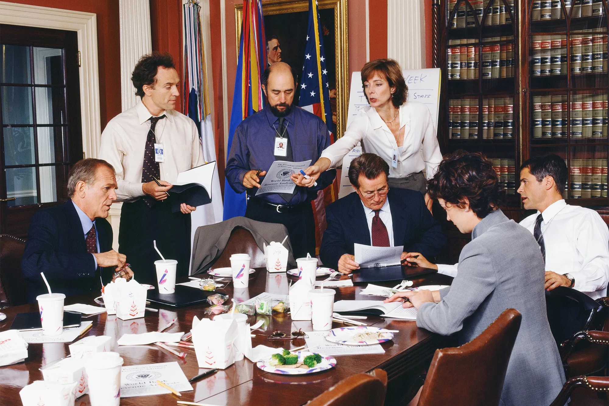

# Nemawashi - Power of building consensus

## Introduction

In the fast-paced world of business and decision-making, ensuring that everyone is on the same page and in agreement is essential. A crucial aspect of effective decision-making is building consensus before a meeting takes place. Consensus-building allows teams to align their thoughts, opinions, and goals, leading to more productive meetings and better outcomes.

In Japanese culture, there is a term that encapsulates this process beautifully - "nemawashi." Nemawashi refers to the practice of laying the groundwork and seeking agreement among stakeholders before a meeting or decision-making process begins. It is a fundamental concept that plays a significant role in achieving harmony and collaboration within organizations.

In this blog post, we will delve into the concept of nemawashi and explore its practical implications for building consensus before meetings. We will discuss the cultural significance of nemawashi in Japan and its relevance in a broader context. Furthermore, we will outline effective strategies that can help you incorporate nemawashi techniques to foster collaboration, engagement, and successful decision-making.

Here we try to understand the art of building consensus and discover how nemawashi can transform your meetings into more fruitful and harmonious experiences. Let's explore the power of nemawashi and its impact on achieving alignment within your team.

## Understanding Nemawashi

Nemawashi, rooted in Japanese culture, holds valuable lessons for building consensus before meetings. By embracing this practice, teams can set the stage for productive discussions and decision-making. Let's explore the meaning and significance of nemawashi, along with some practical examples.

At its core, nemawashi involves laying the groundwork and seeking agreement among stakeholders before a meeting or decision-making process begins. This process allows individuals to voice their opinions, address concerns, and find common ground, leading to smoother decision-making and improved outcomes.

### Example 1: Toyota's Decision-Making Process

One of the most famous examples of nemawashi can be found in the decision-making process at Toyota, a renowned Japanese automobile manufacturer. Before any major decision is made, Toyota follows a meticulous approach that involves extensive consultation and consensus-building.

Teams engage in cross-functional meetings, where representatives from various departments share their perspectives, concerns, and ideas. This process allows for a comprehensive understanding of the issue at hand and helps identify potential obstacles or risks. By incorporating nemawashi, Toyota ensures that decisions are made collaboratively, taking into account the viewpoints of all relevant stakeholders.

Sidebar: [Read more about Toyota's decision-making process here](https://hbr.org/2011/01/how-toyota-makes-decisions)

### Example 2: U.S. Government and Legislative Process

While nemawashi is rooted in Japanese culture, similar principles of consensus-building can be observed in the U.S. government's legislative process. Before bills are brought to the floor for a vote, extensive negotiations, discussions, and consensus-building efforts take place.

In the U.S. Congress, lawmakers engage in committee meetings, hearings, and informal conversations to gather input from various stakeholders. This process allows representatives to address concerns, incorporate amendments, and build consensus among different factions. Through these deliberations, consensus is sought to increase the chances of a bill's successful passage.

An example of how the U.S. legislative process and consensus-building are depicted is the television show "The West Wing." The show portrays the inner workings of the White House and provides insights into the intricate process of developing and passing legislation. It showcases the efforts of policymakers to build consensus, negotiate, and seek agreement among different parties to advance their policy agendas.

While "The West Wing" is a fictional representation, it offers viewers a glimpse into the complexities and nuances of consensus-building in the U.S. political landscape.

Sidebar : [Explore more about "The West Wing" and its depiction of the U.S. legislative process here.](https://www.npr.org/2019/12/20/790948548/the-west-wing-podcast-a-reminder-of-when-consensus-seemed-possible)

By highlighting this example, we can observe that nemawashi-inspired practices and consensus-building efforts exist beyond cultural boundaries. Consensus-building is a universal concept that plays a crucial role in effective decision-making across diverse settings.

## Strategies for Building Consensus

Building consensus before a meeting requires careful planning, effective communication, and fostering a collaborative environment. By employing the following strategies, you can create a foundation for productive discussions and decision-making:

1. Preparing for the Meeting - Thorough preparation is essential for successful consensus-building. Consider the following steps:
    1. Gather Information: Seek input from stakeholders and team members before the meeting. Collect diverse perspectives and insights to gain a comprehensive understanding of the topic at hand.
    2. Address Concerns: Take the time to identify and address any potential concerns or objections that participants may have. Addressing these early on can help mitigate resistance and pave the way for consensus.
    3. One-on-One Meetings: Engage in individual discussions with key stakeholders to understand their viewpoints and gather feedback. This personal touch allows for open and honest conversations, fostering a sense of inclusion and trust.
    4. Invite Contributions: Show respect for stakeholders by genuinely considering their perspectives and inviting their contributions. Recognize that they may bring valuable insights and solutions to the table. This approach promotes collaboration and a sense of ownership among participants.

2. Effective Communication Techniques - Clear and open communication is vital for building consensus. Consider these techniques:
    1. Active Listening: Practice attentive and empathetic listening. Encourage participants to express their thoughts, concerns, and ideas, and ensure that everyone feels heard and respected.
    2. Facilitate Constructive Discussions: Create an inclusive environment where diverse perspectives are encouraged. Set ground rules for respectful dialogue and constructive debate. Guide the conversation towards finding common ground and shared goals.
    3. Visual Aids and Examples: Utilize visual aids, data, and real-life examples to illustrate your points and foster a shared understanding. Visual representations can bridge gaps in perception and facilitate consensus-building.

3. Building Trust and Collaboration - Trust and collaboration are key elements of consensus-building. Consider the following approaches:
    1. Encourage Collaboration: Foster a culture of collaboration by promoting teamwork and emphasizing collective goals. Encourage participants to work together, share ideas, and find mutually beneficial solutions.
    2. Transparency and Accountability: Promote transparency in decision-making processes. Clearly communicate the rationale behind decisions and ensure accountability for actions. This builds trust and confidence among team members.
    3. Inclusive Decision-Making: Involve all relevant stakeholders in the decision-making process. Seek diverse perspectives and involve those who may be affected by the outcome. This inclusive approach increases ownership and commitment to the decisions made.

By incorporating these strategies into your consensus-building efforts, you can lay a solid foundation for successful meetings. Remember to appear open to problem discussions rather than solely focusing on solutions and demonstrate respect for stakeholders by inviting their contributions. Consensus-building requires active engagement and continuous effort to create an environment where diverse voices are valued.

Next up we should discuss the effective ways of communication in order to execute above strategies. And discuss why trust is pramount to executing these strategies. Expect that in the next installment of this blog post.