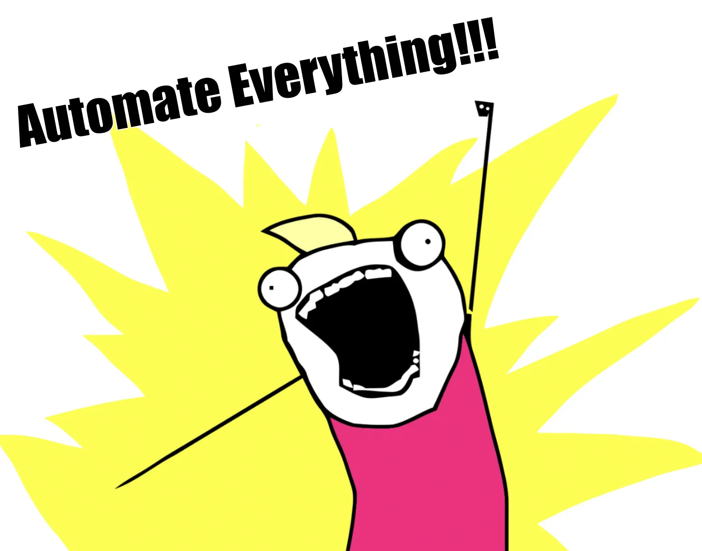

---

title: "The Case for Being Lazy"
date: 2025-02-23T12:40:47Z
draft: false
description: "Why doing the absolute minimum is a gift in software engineering."
image: "virtue-of-lazy.webp"
author: "Osada Paranaliyanage"
theme: "full"
tags: ["software engineering", "best-practices", "engineering culture", "engineering leadership"]
categories: ["engineering culture"]

ruby: true
fraction: true
fontawesome: true
linkToMarkdown: true
rssFullText: false

toc:
enable: true
auto: true
code:
copy: true

share:
enable: true
------------

## Virtue of being lazy

Some of my favorite works of fiction are Discworld novels. And of the many great characters I got to meet, there was one that particularly drew my attention—Rincewind. In one of the books, we are told that his father has a particular arrangement for him in order to fund his study. He has to get a particular score in his exams, or otherwise, he will stop receiving the stipend from his father (I have to confess that I don't remember the exact marks needed). On the flip side, if he gets even one mark beyond this score, he will be considered by the university to have passed the exam and become a wizard, therefore ending his stipend again because he is supposed to receive the stipend only to study. But—and here is the crucial detail—if and only if he gets this exact score, he will never be considered passed by the Unseen University, nor will his father consider him failed in his studies. And thus is born an ironic endeavor—he now studies harder than any other student so that he can get exactly the marks he wants. And this is ultimately much harder than just passing the exam. So in order to be lazy and receive the stipend, he needs to study more. And thus, he ends up spending far more energy on *not* passing the exam than actually passing the exam.

Why did I start this blog post with that detail? Because this has been my go-to scene for explaining why I think being lazy is a virtue. And why being lazy is actually far more work than not being lazy. Whether we are talking about automating things for TOIL in the SRE field, optimizing systems or algorithms for cost or performance, or building high-performance teams, this theme keeps popping up.

## Example 1 : Automate Everything!

TOIL refers to the repetitive, manual, and automatable tasks that are necessary to maintain a service. According to the [Google SRE book](https://sre.google/sre-book/eliminating-toil/), TOIL is work tied to running a production service that tends to be manual, repetitive, automatable, tactical, devoid of enduring value, and that scales linearly as a service grows. Automating TOIL is beneficial because it frees up engineers to focus on more strategic and value-adding activities, reduces human error, and improves the reliability and efficiency of the service. By minimizing TOIL, teams can invest more time in innovation and improving the overall system.

And this is a central practice in SRE teams because this allows them to differentiate themselves from a pure Ops team where the proverbial pushing buttons is the main activity. The pushing button work gets repetitive and boring, so wouldn't it be nice if we did not have to do that and could just sit back and let the computers, which are good at repetitive work, do that work instead? It would be grand! But the catch is that for us to be lazy and watch the computers do all the work, we first have to work harder, expend more energy than we otherwise would, and automate these tasks. And that should be an upfront cost that we should be comfortable paying. You may have your own yardsticks as to when it becomes sensible to do so, but to automate things on principle takes a lot of conviction, and that is why building a true SRE practice is actually hard, especially in traditional organizations.

## Example 2 : FinOps on public cloud

FinOps on public cloud is a prime example of investing effort now to save hassle later. Instead of laboriously poring over monthly bills and manually reconciling cloud usage, savvy teams deploy [automation tools](https://www.finops.org/introduction/what-is-finops/) and real-time dashboards to monitor and optimize spending. By doing so, they can track costs in real-time, set budgets, and receive alerts when spending deviates from expectations. This transforms an otherwise reactive process into a proactive, manageable workflow that keeps financial surprises at bay.

However, setting up an effective FinOps practice requires significant upfront effort. Teams need to integrate [cost-tracking tools](https://aws.amazon.com/aws-cost-management/), configure alerting mechanisms, and continuously refine cost-optimization strategies. While this initial setup demands time and expertise, it ultimately ensures that engineers and finance teams can focus on strategic planning rather than firefighting unexpected cost spikes. Just like automating TOIL, the effort put into FinOps is about making life easier down the road—by working hard now to be lazy later.

We went through this as a team recently, and creating the tools required to track costs, alert us to anomalies, and remove inefficiencies was hard work, but ultimately, it paid off. Again, the conviction to prioritize this and get it done requires that we believe that initial hard work will pay off in the end.

## Example 3: Building highly effective teams

I have now spent more than a decade and a half in this industry, and I am beginning to notice a pattern. Most of the old-timers like myself who have been around more than a couple of teams and/or companies have a favorite company or team they keep referring back to. You can notice that straight away when you get into a "Yeah, this sucks, but how do we make it better?" conversation. And there are ample opportunities for these in any team. Just pick a subject that seems to frustrate them and start talking about what the potential solutions might be, and you will immediately be greeted with a flashback to what they believe was the "best team they were in."

The only part they have missed is how much work went into preparing the groundwork for X to be implemented. This is through no fault of their own. We usually focus on the end result much more than the process to get there, and even if we did not, the process itself might not be visible to folks other than the enablers who made it possible.

Enabling the team to solve their own problems is hard work. It is very tempting to go in and solve the problem at hand. After all, you (think you) know the answer, and if the team just followed your advice, the problem could be solved by lunchtime! But that would be the wrong instinct. Solving the problem for the team is the easy approach. Coaching them to come up with the solution themselves is significantly harder but much more rewarding in the end—and less work for you ultimately. After all, the definition of good in engineering leadership is to coach yourself out of your job!

## Being Lazy on Principle

Like Bret Victor talks about in his now infamous talk in inventing on principle, when you do something, it is better to do it on principle. In any given situation if you think it applies, ask yourself - what will be the way we can solve this by being maximally lazy? This applies to most software engineering decisions being taken in your day to day work. Especially so if you are a staff+ engineer or an engineering manager. What will be the way that you can make sure the work being done for a given task is

1. maximally reusable - \
   So you don't have to repeatedly do the same work. This can take many forms in practice. Maybe you want to put all that code shared by all your microservices in to a [chassis service](https://buoyant.io/2023/06/01/what-is-a-chassis-service/)? Or maybe you want to gather up all the validation logic spread across different build units in to a single linter tool. Or you go the whole hog and create a [platform around the reusable parts](https://www.cncf.io/reports/platform-engineering-whitepaper/).
2. completed with least effort - so you [remove any accidental complexity leaving only inherent complexity in](https://www.infoq.com/presentations/Simple-Made-Easy/).
3. maximally automated - so you remove the human from the equation. this decreases mistakes and maximizes utility of your engineers.

## Transitioning from Mid to Senior

At every software engineer's professional journey, there will be a time when they transition to being a senior engineer. In my opinion a large part of this is getting rid of the desire to be clever and do smart engineering. We all spent some time in our career being awed by all the amazing clever code we could create with the very sharp tools in our repertoire, whether that is Template Meta Programming in C++ or Monkey Patching in Python or Ruby. And then we wanted to emulate that and write come clever™ code.

There comes a time when we finally understand that it is more important to be understood and write maintainable code than be clever. That's when you learn to be truly lazy and use a very easy to understand subset of the toolbox available to you and realize that this is a feature and not a bug. You don't have to use the full surface area of your language/framework/platform in order to build successful maintainable products. Be a little lazy. Stick to common things.

## Conclusion

Being lazy, when done right, is one of the most powerful tools in an engineer's arsenal. It’s not about avoiding work—it’s about making smart decisions that reduce unnecessary effort in the long run. Whether it’s automating toil, optimizing costs, enabling teams to solve their own problems, or simplifying code for maintainability, the principle remains the same: **invest effort upfront to save exponentially more later**.

The best engineers and leaders understand that their job is not to write the most code or build the most complex systems, but to ensure that things are done **in the simplest, most efficient, and most reusable way possible**. True engineering excellence is knowing **where** to put in effort and **where** to step back.

So, if you ever find yourself in a position where brute force feels like the answer, stop and ask: *What’s the laziest way to solve this problem?* Chances are, the best solution is also the one that requires the least ongoing work.

**Be lazy. But be lazy on principle.**
